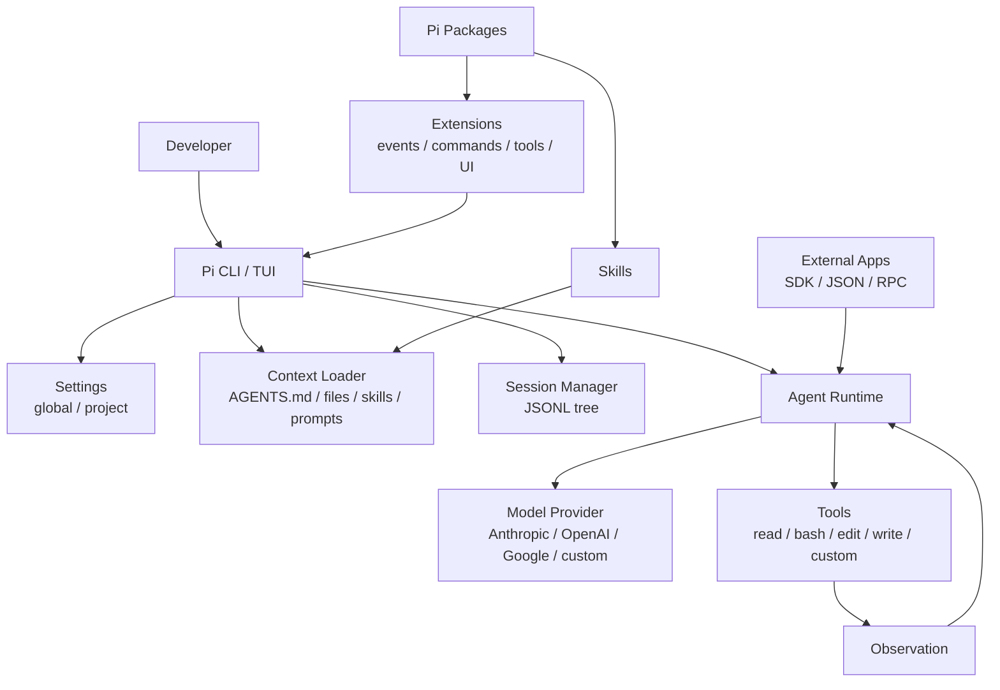

# 第一章 初识 Pi Agent：terminal coding harness 是什么

欢迎来到 Pi Agent 的世界。本章不急着安装和写 extension，而是先回答一个基础问题：Pi 到底是什么？如果这个问题没有想清楚，后面的 tools、session、skills、packages、RPC 和 SDK 都会像一组散乱功能点。

本章的核心判断是：**Pi 不是一个简单的 LLM CLI，而是一个 terminal coding agent harness**。它把模型、工具、上下文、session、扩展系统和人机交互组织成一个可以持续工作的工程环境。

## 1.1 本章目标与最终产物

完成本章后，你应该能：

- 区分 LLM Chat、coding agent 和 agent harness。
- 解释 Pi 为什么需要 session、tools、extensions、skills 和 packages。
- 画出 Pi 的核心架构图。
- 判断一个需求应该落在 prompt、skill、extension、package 还是 SDK/RPC 层。

本章最终产物是一张自己的 Pi mental model 图。它会在后续章节不断细化。

## 1.2 从 LLM CLI 到 Coding Agent

普通 LLM CLI 的基本模式是：用户输入，模型输出。它的能力边界主要是文本生成。开发者仍然要自己决定读哪些文件、运行哪些命令、怎么验证结果、如何保存上下文。

Coding agent 的关键变化是引入行动能力。模型不只是回答问题，而是在工具约束下读取文件、执行 shell、修改代码、观察结果，再继续推理。它的基本循环变成：

```text
Goal -> Think -> Tool Call -> Observation -> Think -> ...
```

但一旦允许模型行动，系统就必须回答更多工程问题：

- 工具参数如何约束？
- 危险命令如何确认或阻止？
- 长任务如何保存和恢复？
- 上下文过长时如何压缩？
- 项目规范如何稳定注入？
- 用户如何扩展工具和命令？
- 外部系统如何驱动 agent？

Pi 的价值就在这里：它把这些问题放进一个可扩展 harness 中，而不是让每个用户自己拼凑脚本。

## 1.3 Pi 的四层结构

上游仓库 [earendil-works/pi](https://github.com/earendil-works/pi) 中，几个核心包可以理解为四层：

| 层级 | Package | 责任 |
|---|---|---|
| AI API 层 | `@earendil-works/pi-ai` | 统一多 provider LLM API，例如 OpenAI、Anthropic、Google |
| Agent runtime 层 | `@earendil-works/pi-agent-core` | 处理 tool calling、agent state 和运行循环 |
| Coding harness 层 | `@earendil-works/pi-coding-agent` | CLI、session、settings、extensions、skills、programmatic modes |
| Terminal UI 层 | `@earendil-works/pi-tui` | TUI 组件、差量渲染和终端交互 |

一个简化公式：

```text
Pi = model abstraction + agent loop + coding tools + session manager + extension system + terminal UI
```

这也是为什么 Pi 既能作为日常 CLI，又能作为 SDK/RPC 集成目标。

## 1.4 Pi 的核心架构图



这张图有两个重点：

1. **Model 不是中心，Runtime 才是中心。** 模型负责推理和生成 tool call，但真正决定能做什么的是 runtime、tools、context 和 session。
2. **扩展点不是一个。** Pi 同时提供 prompt、skill、extension、package、SDK/RPC，这是为了覆盖不同粒度的复用需求。

## 1.5 Pi 与常见工具形态对比

| 形态 | 典型能力 | 不足 | Pi 的位置 |
|---|---|---|---|
| ChatGPT / Web Chat | 问答、解释、生成代码片段 | 不能直接操作项目环境 | Pi 把模型接到本地工程环境 |
| IDE Copilot | 补全、局部编辑 | 任务状态和工具循环较弱 | Pi 更偏 terminal workflow 和 session |
| Shell script | 可自动化、可复现 | 缺少模型推理和动态决策 | Pi 让模型在工具边界内选择行动 |
| Agent framework | 可编排 agent loop | 往往需要自己接 CLI、session、settings | Pi 提供成品 coding harness |
| Pi | CLI、tools、session、extensions、skills、SDK/RPC | 需要理解边界和安全策略 | 适合构建可维护 coding workflow |

Pi 不是要替代所有工具，而是承担“把模型行动能力接入开发环境”的角色。

## 1.6 五种扩展层级

后续章节会反复遇到一个问题：某个需求应该放在哪里？先记住这张表。

| 需求 | 推荐层级 | 例子 |
|---|---|---|
| 临时改变本次行为 | Prompt | “先列计划，不要改文件” |
| 固定项目规则 | `AGENTS.md` / settings | 代码风格、测试命令、禁止危险 git 操作 |
| 可复用工作流知识 | Skill | repo review SOP、release checklist |
| 本机运行时能力 | Extension | custom tool、slash command、tool_call safety hook |
| 团队分发 | Pi Package | safety extension + review skill + prompt templates |
| 外部系统集成 | SDK / JSON / RPC | IDE、CI、脚本、Web UI |

经验规则：**能用 prompt 解决的一次性问题不要写 extension；需要拦截 runtime 事件的问题不要只写 skill。**

## 1.7 动手体验：5 分钟建立 Pi mental model

本章不要求你完成复杂配置，只做三个只读动作。

### 1.7.1 查看 Pi 版本

```bash
pi --version
```

如果还没安装，先跳到第三章。安装命令是：

```bash
npm install -g --ignore-scripts @earendil-works/pi-coding-agent
```

### 1.7.2 查看官方文档入口

```bash
open https://pi.dev/docs/latest
```

没有 GUI 时：

```bash
python3 - <<'PY'
print("Read https://pi.dev/docs/latest in your browser.")
PY
```

### 1.7.3 写下你的分层判断

用下面模板记录一个你想自动化的工作流：

```text
Workflow:
One-time prompt:
Project instruction:
Skill:
Extension:
Package:
SDK/RPC integration:
```

例子：

```text
Workflow: Review current repository changes before merge.
One-time prompt: Focus on correctness and missing tests.
Project instruction: Follow AGENTS.md and do not run destructive git commands.
Skill: repo-review.
Extension: block git push --force and rm -rf.
Package: team-review-workflow.
SDK/RPC integration: CI job that captures JSON event stream.
```

## 1.8 常见误区

| 误区 | 更好的判断 |
|---|---|
| Pi 等于某个模型 | Pi 可以连接多个 provider，模型只是 runtime 的一个输入 |
| Tool 越多越好 | Tool 会扩大权限面和上下文噪音 |
| Skill 是插件 | Skill 主要是给 agent 的能力说明和辅助材料，不是本机代码 hook |
| Extension 只是命令别名 | Extension 可以订阅事件、注册工具、拦截危险动作和扩展 UI |
| Session 只是聊天记录 | Pi session 是可分支、可压缩、可恢复的 JSONL 状态树 |
| SDK/RPC 是高级玩具 | 它们是把 Pi 接入 IDE、CI、脚本和自定义 UI 的正式入口 |

## 1.9 本章小结

Pi 的核心不是“让模型回答问题”，而是把模型、工具、上下文、人类确认和持久 session 放到一个可扩展 harness 中。理解这个定位后，后续章节的每个机制都会变得自然：

- settings 和 provider 解决运行配置。
- agent loop 解决行动循环。
- context 和 compaction 解决长期任务的信息边界。
- session tree 解决恢复和分支。
- extensions、skills、packages 解决复用和扩展。
- SDK、JSON、RPC 解决外部集成。

## 习题

1. 用一句话解释 Pi 和普通 LLM CLI 的差别。
2. 选一个你日常 workflow，判断它应该用 prompt、skill、extension、package 还是 SDK/RPC 实现。
3. 画出你自己的 Pi mental model 图，并标出哪些部分由 Pi 核心提供，哪些部分由用户扩展。

## 参考资料

- [Pi latest docs](https://pi.dev/docs/latest)
- [earendil-works/pi](https://github.com/earendil-works/pi)
- [Pi Extensions](https://pi.dev/docs/latest/extensions)
- [Pi Skills](https://pi.dev/docs/latest/skills)
- [Pi Packages](https://pi.dev/docs/latest/packages)
