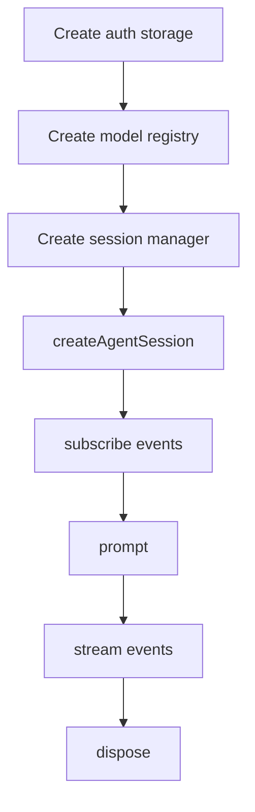

# 第十二章 SDK 实战：在 Node.js 中嵌入 Pi Agent Session

JSON 和 RPC 适合从外部进程驱动 Pi。如果你的应用本身就是 Node.js/TypeScript，更直接的方式是使用 Pi SDK 创建 `AgentSession`。本章关注同进程集成：生命周期、事件订阅、session manager 和错误处理。

## 12.1 本章目标与最终产物

完成本章后，你应该能：

- 解释 SDK 与 RPC 的区别。
- 创建一个 in-memory `AgentSession`。
- 订阅 streaming event。
- 发送 prompt。
- 正确释放 session。
- 判断什么时候需要 runtime API 而不是单个 session API。

本章最终产物：

```bash
code/chapter10-programmatic-usage/sdk-minimal.ts
```

## 12.2 SDK 不等于 RPC

| 维度 | SDK | RPC |
|---|---|---|
| 进程模型 | 同进程 | 子进程 |
| 类型信息 | TypeScript 类型可用 | JSON protocol |
| 控制粒度 | 更细 | 协议限定 |
| 语言 | Node.js/TypeScript | 任意语言 |
| 错误处理 | try/catch + event | response + event + exit code |
| 适合 | Node app、测试、自定义 runtime | IDE bridge、跨语言、外部 UI |

如果你写的是 Node.js 工具，优先考虑 SDK；如果你写的是 Python/Swift/Kotlin 或外部 UI，RPC 更通用。

## 12.3 最小程序

```typescript
import {
  AuthStorage,
  createAgentSession,
  ModelRegistry,
  SessionManager,
} from "@earendil-works/pi-coding-agent";

const authStorage = AuthStorage.create();
const modelRegistry = ModelRegistry.create(authStorage);

const { session } = await createAgentSession({
  sessionManager: SessionManager.inMemory(),
  authStorage,
  modelRegistry,
});

session.subscribe((event) => {
  if (event.type === "message_update" && event.assistantMessageEvent.type === "text_delta") {
    process.stdout.write(event.assistantMessageEvent.delta);
  }
});

try {
  await session.prompt("What files are in the current directory?");
} finally {
  session.dispose();
}
```

## 12.4 运行前提

安装 SDK 包：

```bash
npm install @earendil-works/pi-coding-agent
```

需要已完成 provider 认证或配置 API key。SDK 示例不是纯离线示例。

本仓库没有默认安装依赖，因此这里只提供源码示例，不在验证脚本中强制运行。

## 12.5 AgentSession 生命周期



关键原则：

- 订阅 event 后要知道何时取消或释放。
- 程序结束前调用 `session.dispose()`。
- `prompt()` resolve 不等于你已经处理了所有业务状态；最终输出应由 event 和返回结果共同决定。

## 12.6 SessionManager

SDK 示例使用：

```typescript
SessionManager.inMemory()
```

这适合测试和一次性自动化。如果需要持久化 session，应使用可写 session manager，并明确 session 目录。

| 方式 | 适合 |
|---|---|
| `SessionManager.inMemory()` | 单次任务、测试 |
| project session manager | 需要保存、恢复、审计 |
| custom session dir | CI 或工具隔离 |

## 12.7 Event subscription

SDK 的核心不是一次性拿到完整回答，而是订阅事件：

| Event | 用途 |
|---|---|
| `message_update` | 流式文本 |
| `tool_execution_start` | 记录工具开始 |
| `tool_execution_end` | 判断工具成功或失败 |
| `queue_update` | 跟踪 steering 和 follow-up |
| `compaction_start` / `compaction_end` | 调试上下文压缩 |
| `agent_end` | 判断 run 结束 |

示例只打印 text delta。真实工具应把 event 转成结构化日志。

## 12.8 Runtime API 什么时候需要

`AgentSession` 管理单个 session。以下操作涉及 session replacement 或 cwd-bound runtime state，通常需要 runtime API：

- new session。
- switch session。
- fork。
- import JSONL。
- 重新绑定 extensions。

如果你只是发 prompt 并读取 streaming，`AgentSession` 足够。如果你在做完整 TUI/IDE，则需要理解 runtime API。

## 12.9 常见问题

| 问题 | 建议 |
|---|---|
| 程序不退出 | 确认调用 `session.dispose()` |
| 没有模型可用 | 先在 Pi CLI 中完成登录或配置 key |
| 事件太多 | 只订阅并处理你关心的 event type |
| 想切换 session | 使用 runtime API，而不是只操作 `AgentSession` |
| SDK 示例不能离线跑 | 需要 provider/model 认证 |
| 输出和 TUI 不一致 | 检查 resource loader、settings 和 cwd |

## 12.10 本章小结

SDK 适合 Node.js 深度集成。它让你直接控制 Pi agent session，但也要求你承担生命周期管理、认证、事件订阅和错误处理。第十三章会切到子进程协议，适合跨语言和外部 UI。

## 习题

1. 修改示例，只打印 `tool_execution_*` 事件。
2. 增加 prompt 参数，从 CLI 读取用户输入。
3. 把 in-memory session 改为持久化 session，并记录 session file。
4. 设计一个 SDK test harness，自动发送 prompt 并断言 event 类型。

## 参考资料

- [SDK](https://pi.dev/docs/latest/sdk)
- [RPC Mode](https://pi.dev/docs/latest/rpc)
- [Session Format](https://pi.dev/docs/latest/session-format)
