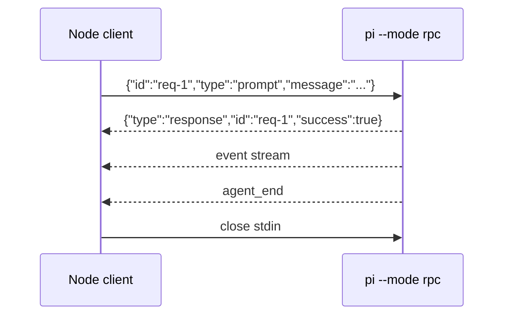

# 第十三章 JSON 与 RPC 模式：外部进程如何驱动 Pi

当 Pi 需要嵌入 IDE、CI、脚本或自定义 UI 时，interactive TUI 不再足够。本章重点讲两种子进程集成方式：JSON event stream mode 和 RPC mode。SDK 已在第十二章单独讨论。

核心区别很简单：**JSON mode 适合观察一次任务，RPC mode 适合长期控制一个 Pi 子进程。**

## 13.1 本章目标与最终产物

完成本章后，你应该能：

- 使用 `pi --mode json` 读取结构化事件。
- 写一个脚本统计 event 类型。
- 使用 `pi --mode rpc` 通过 stdin/stdout 发送 command。
- 理解 JSONL framing 的注意点。
- 判断什么时候使用 JSON、RPC 或 SDK。

本章最终产物：

```bash
code/chapter10-programmatic-usage/json-events.mjs
code/chapter10-programmatic-usage/rpc-client.mjs
```

## 13.2 三种 programmatic usage 对比

| 方式 | 命令/API | 生命周期 | 适合 |
|---|---|---|---|
| JSON event stream | `pi --mode json "prompt"` | 单次 prompt | 一次性任务、日志消费、CI 只读分析 |
| RPC mode | `pi --mode rpc` | 长生命周期子进程 | 外部 UI、IDE bridge、跨语言控制 |
| SDK | `createAgentSession()` | Node.js 同进程 | 深度集成、测试、细粒度控制 |

决策规则：

- 只想跑一次 prompt 并观察结果：JSON mode。
- 需要多次 prompt、get state、abort、new session：RPC mode。
- 应用本身就是 Node.js/TypeScript：优先 SDK。

## 13.3 JSON event stream mode

基础命令：

```bash
pi --mode json "List files"
```

它会把 session header 和 event 作为 JSON lines 输出到 stdout。每一行都是一个独立 JSON object。

常见过滤：

```bash
pi --mode json "List files" 2>/dev/null | jq -c 'select(.type == "message_end")'
```

输出形态类似：

```json
{"type":"session","version":3,"id":"...","timestamp":"...","cwd":"/path/to/project"}
{"type":"agent_start"}
{"type":"turn_start"}
{"type":"message_start","message":{"role":"assistant","content":[]}}
{"type":"message_update","assistantMessageEvent":{"type":"text_delta","delta":"..."}}
{"type":"message_end","message":{"role":"assistant","content":[...]}}
{"type":"agent_end","messages":[...]}
```

## 13.4 JSON 示例脚本

运行：

```bash
node code/chapter10-programmatic-usage/json-events.mjs "List files"
```

脚本做了三件事：

1. 启动 `pi --mode json <prompt>`。
2. 按 `\n` 分割 stdout，逐行 `JSON.parse()`。
3. 对 event type 计数，并把 `text_delta` 打印到 stdout。

预期输出：

```text
...assistant streaming text...

Event counts:
  agent_end: 1
  agent_start: 1
  message_end: 1
  message_start: 1
  message_update: 12
  turn_end: 1
  turn_start: 1
```

实际计数会因模型、工具调用和 prompt 不同而变化。

## 13.5 RPC mode

启动：

```bash
pi --mode rpc [options]
```

常见 options：

```bash
pi --mode rpc --no-session
pi --mode rpc --provider anthropic --model claude-sonnet-4-5
pi --mode rpc --name "External UI session"
```

RPC 使用 stdin/stdout JSONL：

- command 从 stdin 输入，一行一个 JSON object。
- response 和 event 从 stdout 输出，一行一个 JSON object。
- command 可带 `id`，response 会带同一个 `id`。

发送 prompt：

```json
{"id":"req-1","type":"prompt","message":"Hello, world!"}
```

成功响应：

```json
{"id":"req-1","type":"response","command":"prompt","success":true}
```

## 13.6 JSONL framing 注意点

RPC mode 对 framing 很严格：

- 只按 LF `\n` 分割记录。
- 可以接受 CRLF，但要去掉尾部 `\r`。
- 不要用会把 Unicode separators 当换行的 generic line reader。
- Node.js 中不要随意用 `readline` 处理 RPC protocol。

本教程脚本使用 `buffer.indexOf("\n")` 手动分割。

## 13.7 RPC 示例脚本

运行：

```bash
node code/chapter10-programmatic-usage/rpc-client.mjs "Summarize this repository"
```

脚本流程：



如果 prompt 未被接受，脚本会在退出时打印：

```text
Prompt was not accepted by RPC mode.
```

## 13.8 常用 RPC command

| Command | 用途 |
|---|---|
| `prompt` | 发送用户 prompt |
| `steer` | 在 streaming 中插入纠偏消息 |
| `follow_up` | 当前 run 完成后继续执行 |
| `abort` | 中止当前操作 |
| `get_state` | 获取当前状态 |
| `get_messages` | 获取当前消息 |
| `new_session` | 新建 session |
| `set_model` | 切换 model |
| `compact` | 触发 compaction |

外部 UI 通常至少需要 `prompt`、`get_state`、`abort` 和 event stream。

## 13.9 错误处理

脚本集成 Pi 时必须处理：

| 错误 | 处理 |
|---|---|
| 子进程 spawn 失败 | 检查 `pi` 是否在 `PATH` |
| JSON parse 失败 | 打印原始行并退出 |
| command response `success:false` | 根据 command id 显示错误 |
| stderr 有 provider error | 保留 stderr 日志 |
| 子进程非 0 退出 | CI 中 fail fast |
| agent 无响应 | 设置超时并 abort |

不要只读取最终文本。对于自动化系统，event 和 exit code 同样重要。

## 13.10 本章小结

JSON mode 和 RPC mode 把 Pi 从个人 TUI 扩展为可嵌入的 agent runtime。JSON mode 简单、适合一次性观察；RPC mode 复杂但可控，适合长期外部进程。Node.js 深度集成则优先考虑 SDK。

## 习题

1. 修改 `json-events.mjs`，只统计 `tool_execution_*` event。
2. 修改 `rpc-client.mjs`，在发送 prompt 前先发送 `get_state`。
3. 给 RPC client 增加 60 秒超时，超时后发送 `abort`。
4. 设计一个 CI 只读 review job，说明它为什么应该使用 JSON mode 而不是 interactive mode。

## 参考资料

- [RPC Mode](https://pi.dev/docs/latest/rpc)
- [JSON Event Stream Mode](https://pi.dev/docs/latest/json)
- [SDK](https://pi.dev/docs/latest/sdk)
