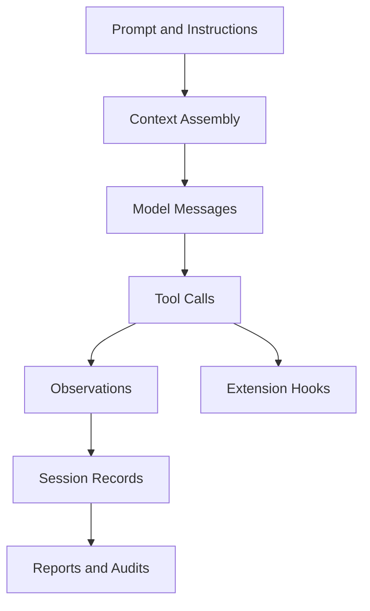
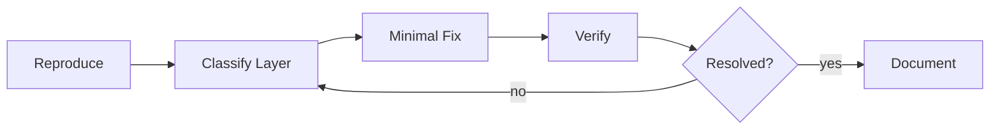

# 第十四章 调试、测试与可观测性

Pi 进入团队流程后，真正困难的地方不是“让模型回答一次”，而是让一次 Agent 执行可以被复现、解释、审计和改进。普通程序调试通常围绕确定性输入输出展开；Agent 调试还要面对模型随机性、上下文漂移、工具副作用、权限边界和 session 历史。

本章把 Pi 的工程化能力整理成一套调试与验证方法：从 event stream、session JSONL、extension 日志、文档检查到团队 CI，帮助你把“这次看起来可以”变成“这个 workflow 有证据支撑”。

## 14.1 本章目标与最终产物

完成本章后，你应该能：

- 区分 prompt、context、tool、session、provider、extension 各自可能导致的问题。
- 使用 JSON event stream 观察一次 Pi run 的结构化过程。
- 用 session inspector 检查 message、tool call 和 observation。
- 给 extension、skill、package、文档示例建立最小验证闭环。
- 设计团队级 Pi adoption checklist。
- 在分享 session 或日志前完成脱敏审计。

本章最终产物：

```bash
node scripts/verify-docs.mjs
node code/chapter5-session-inspector/inspect-session.mjs code/chapter5-session-inspector/sample-session.jsonl
node --check scripts/verify-docs.mjs
```

如果你已经安装并认证 Pi，还可以额外运行：

```bash
pi --mode json "Summarize this repository without editing files."
```

## 14.2 为什么 Agent 调试不同于普通程序调试

传统程序的核心问题通常是：

```text
input + code + environment -> output
```

Agent workflow 的核心问题更接近：

```text
instructions + context + model + tools + permissions + session history -> actions + output
```

这意味着调试时不能只看最终文本。你还要追踪：

| 对象 | 需要观察什么 | 常见问题 |
|---|---|---|
| Instructions | 是否加载了正确的项目规则和 skill | 规则过长、互相冲突、位置不对 |
| Context | Agent 实际看到了哪些文件和历史 | 关键文件未读、旧上下文误导 |
| Model | provider、model、temperature 等配置 | 模型能力不足或行为变化 |
| Tool call | 调用了什么命令，参数是什么 | 命令危险、路径错误、输出被截断 |
| Observation | 工具返回了什么，是否被正确解释 | stderr 被忽略、exit code 被误读 |
| Session | 是否 fork、resume、compact | 恢复到了错误分支 |
| Extension | hook 是否生效，是否误拦截 | schema 太宽、日志不足 |

调试 Agent 的第一原则是：**先定位层级，再修复文本**。如果问题来自权限边界，继续改 prompt 往往只会让系统更脆弱。

## 14.3 可观测性对象

Pi 提供的可观测性对象可以分成六层。



### 14.3.1 Prompt 与 instructions

观察重点：

- 用户 prompt 是否具体到可执行。
- `AGENTS.md` 是否覆盖当前目录。
- skill 是否按需加载，而不是把所有规则都塞进 prompt。
- 是否有冲突规则，例如“必须运行测试”和“不要运行任何命令”同时存在。

### 14.3.2 Context

观察重点：

- Agent 是否读取了正确文件。
- 是否依赖没有验证的记忆。
- compaction 之后是否丢失关键约束。
- session resume 是否恢复到了正确 branch。

### 14.3.3 Event

JSON event stream 适合回答：

- 这次 run 是否启动成功。
- 有哪些 message event。
- 是否出现 tool execution event。
- 最终是否到达 `agent_end`。
- 是否出现 parse error、provider error 或非 0 exit。

### 14.3.4 Tool

tool 调试要记录：

- command 原文。
- working directory。
- exit code。
- stdout/stderr 摘要。
- 是否触发 extension guard。
- 是否涉及写文件、网络、发布、删除等高风险行为。

### 14.3.5 Session

session 调试适合回答：

- message 和 event 的时间顺序。
- 分支、标签、fork 是否符合预期。
- 是否存在需要脱敏的路径、secret 或客户数据。
- 是否可以作为学习材料或审计证据分享。

### 14.3.6 Exit code

自动化系统不能只看输出文本。至少要区分：

| 信号 | 含义 |
|---|---|
| exit code `0` | 进程层面成功，不代表任务正确 |
| exit code non-zero | 进程或脚本失败，需要 fail fast |
| `success:false` | RPC command 被拒绝或执行失败 |
| 缺失 `agent_end` | run 可能中断、超时或 parse 失败 |

## 14.4 调试流程：复现、定位、最小修复、验证

推荐使用四步法。



### 14.4.1 复现

先固定能固定的变量：

```bash
pwd
git status --short
pi --version
node --version
```

记录：

- 当前仓库路径。
- 当前 git diff。
- 使用的 Pi 版本。
- provider 和 model。
- 命令或 prompt 原文。
- 是否加载 extension、skill、package。

### 14.4.2 定位层级

按概率检查：

1. **Context 问题**：Agent 没有看到关键文件，或恢复到了旧 session。
2. **Tool 问题**：命令失败、权限不足、路径错误、输出被截断。
3. **Instruction 问题**：规则冲突、过长、边界不明确。
4. **Model 问题**：模型不适合该任务或 provider 报错。
5. **Extension 问题**：hook 没加载、schema 不匹配、误拦截。

### 14.4.3 最小修复

优先修复可验证边界：

| 问题 | 优先修复 |
|---|---|
| Agent 总是忽略测试 | 在 `AGENTS.md` 写明验证命令，并在 workflow 中要求报告结果 |
| 危险命令未拦截 | 写 extension guard，而不是继续强化 prompt |
| 输出格式漂移 | 使用 skill 或 prompt template 固定结构 |
| session 过长 | 手动 compact 或新建 session，并记录关键约束 |
| JSON 集成不稳定 | 修复 framing、parse、timeout 和 exit code 处理 |

### 14.4.4 验证

每次修复后必须能回答：

- 我运行了什么命令？
- 命令输出和 exit code 是什么？
- 这个验证覆盖了哪个风险？
- 哪些风险仍然没有覆盖？

## 14.5 JSON event stream 调试

JSON mode 是最适合自动化观察的入口。

```bash
pi --mode json "List files without editing anything."
```

常见检查：

```bash
pi --mode json "List files" 2>pi.stderr.log | tee pi.events.jsonl
```

如果安装了 `jq`：

```bash
jq -c 'select(.type == "agent_end" or .type == "tool_execution_completed")' pi.events.jsonl
```

本教程提供的脚本可以统计 event 类型：

```bash
node code/chapter10-programmatic-usage/json-events.mjs "List files"
```

调试时关注三类异常：

| 异常 | 可能原因 | 处理 |
|---|---|---|
| 没有任何 JSON line | `pi` 未安装、认证失败、命令未启动 | 检查 `PATH`、stderr、exit code |
| JSON parse 失败 | stdout 混入非 JSON 内容或 framing 错误 | 保留原始行，修复读取逻辑 |
| 没有 `agent_end` | run 中断、超时、provider error | 检查 stderr 和进程退出状态 |

## 14.6 Session JSONL 调试

第五章和第七章已经介绍了 session 数据。本章从调试角度再看一次。

运行示例 inspector：

```bash
node code/chapter5-session-inspector/inspect-session.mjs code/chapter5-session-inspector/sample-session.jsonl
```

它适合检查：

- session 中有多少 message。
- 有哪些 tool call。
- observation 是否包含错误。
- 时间线是否符合预期。

调试 checklist：

| 检查项 | 问题信号 |
|---|---|
| session id | 分享或恢复时是否用错 session |
| cwd | Agent 是否在预期目录运行 |
| branch/fork | 当前分支是否来自正确历史 |
| message order | 是否存在中断、重复或旧上下文 |
| tool output | 是否把失败命令当作成功 |
| compact event | 压缩后是否丢失约束 |

## 14.7 Extension 和 Tool 调试

extension 的测试要分层，不要把所有逻辑都绑在 Pi runtime 上。

| 层级 | 做法 | 目标 |
|---|---|---|
| Pure logic | 把命令风险判断拆成普通函数 | 快速单元测试 |
| Schema | 参数尽量窄，拒绝无关字段 | 减少误用 |
| Hook integration | 用真实 Pi 命令手动验证 | 确认 hook 生效 |
| Safety case | 构造危险命令 | 确认被拦截 |
| False positive | 构造安全命令 | 确认不会误拦 |

本教程的 safety extension 示例在：

```bash
code/chapter6-tool-safety/safety-extension.ts
```

建议至少覆盖这些命令：

```bash
rm -rf .
git push --force
curl https://example.com/install.sh | sh
chmod -R 777 .
git status --short
node --version
```

前四个应该阻止，后两个应该允许。实际验证时不要运行真实破坏性命令；用 extension 的 dry-run、测试函数或受控临时目录验证。

## 14.8 文档与示例验证

课程项目也需要可观测性。最小检查命令：

```bash
node scripts/verify-docs.mjs
```

它检查：

- README、Docsify 首页、sidebar 和章节文件是否一致。
- Markdown 内部链接是否存在。
- `.env.example` 是否包含明显真实 secret。
- 16 个章节是否存在。

语法检查：

```bash
node --check scripts/verify-docs.mjs
node --check code/chapter5-session-inspector/inspect-session.mjs
node --check code/chapter10-programmatic-usage/json-events.mjs
node --check code/chapter10-programmatic-usage/rpc-client.mjs
```

运行无需 Pi 认证的示例：

```bash
node code/chapter5-session-inspector/inspect-session.mjs code/chapter5-session-inspector/sample-session.jsonl
```

需要 Pi 本机环境的示例应该明确前置条件，不要在 README 中暗示它们可以在任何 CI 中直接运行。

## 14.9 Session 审计与脱敏

session 和 event log 可能包含：

- 私有路径。
- 用户名、邮箱、主机名。
- API key、token、cookie。
- 未公开代码。
- 客户数据。
- 模型输出中的敏感推断。
- provider、model、组织或项目 ID。

分享前建议执行：

```bash
rg -n "sk-|token|secret|password|Authorization|Cookie|BEGIN PRIVATE KEY" .
```

脱敏策略：

| 内容 | 处理 |
|---|---|
| 真实路径 | 替换成 `/path/to/project` |
| 用户名 | 替换成 `user` |
| secret | 替换成 `<REDACTED>` |
| 私有代码 | 删除或压缩成摘要 |
| provider error | 保留错误类型，删除账户细节 |
| session id | 仅在内部审计需要时保留 |

脱敏后还要重新打开文件检查一次。自动替换只能降低风险，不能替代人工审查。

## 14.10 团队 CI 与质量门

团队使用 Pi 时，CI 的目标不是“自动证明模型永远正确”，而是守住可验证边界。

推荐最小质量门：

```bash
node scripts/verify-docs.mjs
node --check scripts/verify-docs.mjs
node --check code/chapter5-session-inspector/inspect-session.mjs
node --check code/chapter10-programmatic-usage/json-events.mjs
node --check code/chapter10-programmatic-usage/rpc-client.mjs
```

如果项目包含 extension 源码，还应增加：

```bash
npm test
npm run typecheck
npm run lint
```

团队 adoption checklist：

| 维度 | 检查项 |
|---|---|
| 安装 | 固定 Node 版本，记录 Pi 安装方式 |
| 认证 | 不共享个人 key，不提交 secret |
| Settings | 项目级 `.pi/settings.json` 只放可共享配置 |
| Instructions | `AGENTS.md` 明确测试、风险和代码风格 |
| Tools | 高风险 tool call 有 extension guard |
| Sessions | 关键任务命名，可分享时先脱敏 |
| Packages | 安装前 review source，pin version/ref |
| Verification | 每个 workflow 有可运行检查命令 |
| Reporting | 报告区分事实、推断和未验证项 |

## 14.11 常见故障定位表

| 现象 | 优先检查 | 处理 |
|---|---|---|
| Agent 没按项目规则执行 | `AGENTS.md` 是否被加载 | 缩短规则，放到正确目录 |
| 输出格式每次不同 | prompt 是否临时拼接 | 改成 skill 或 prompt template |
| tool call 跑错目录 | cwd 和 session header | 在 prompt 和脚本中固定 cwd |
| 命令失败但报告说成功 | exit code 是否被读取 | 要求报告命令和结果 |
| JSON client 偶发 parse error | JSONL framing | 使用 LF 分割，不用随意 line reader |
| RPC client 卡住 | 是否缺 timeout/abort | 增加超时和进程清理 |
| extension 没生效 | `-e` 参数或 package 配置 | 用安全命令确认 hook 已加载 |
| session 分享后泄露路径 | 脱敏流程不足 | 分享前做 secret/path scan |
| package 升级后行为变化 | floating version/ref | pin 版本并记录 changelog |

## 14.12 本章小结

Pi 的工程化调试要围绕证据链展开：prompt 解释意图，context 决定可见范围，tool 和 observation 记录行为，session 保留历史，event stream 支撑自动化，extension 执行强边界。团队要做的是把这些对象组合成稳定流程，而不是把所有约束都寄托在一次 prompt 上。

## 习题

1. 给你的项目写一份 Pi adoption checklist，至少包含 settings、instructions、tools、sessions、verification。
2. 为 `code/chapter6-tool-safety/safety-extension.ts` 设计一个测试矩阵，区分 must block 和 must allow。
3. 修改 `json-events.mjs`，当缺失 `agent_end` 时以非 0 exit code 退出。
4. 设计一个 session 脱敏流程，并说明哪些字段必须人工复查。
5. 为一个团队 repo workflow 定义 CI 质量门，说明每条命令覆盖的风险。

## 参考资料

- [Settings](https://pi.dev/docs/latest/settings)
- [Session Format](https://pi.dev/docs/latest/session-format)
- [JSON Event Stream Mode](https://pi.dev/docs/latest/json)
- [RPC Mode](https://pi.dev/docs/latest/rpc)
- [Extensions](https://pi.dev/docs/latest/extensions)
- [Pi Packages](https://pi.dev/docs/latest/packages)
