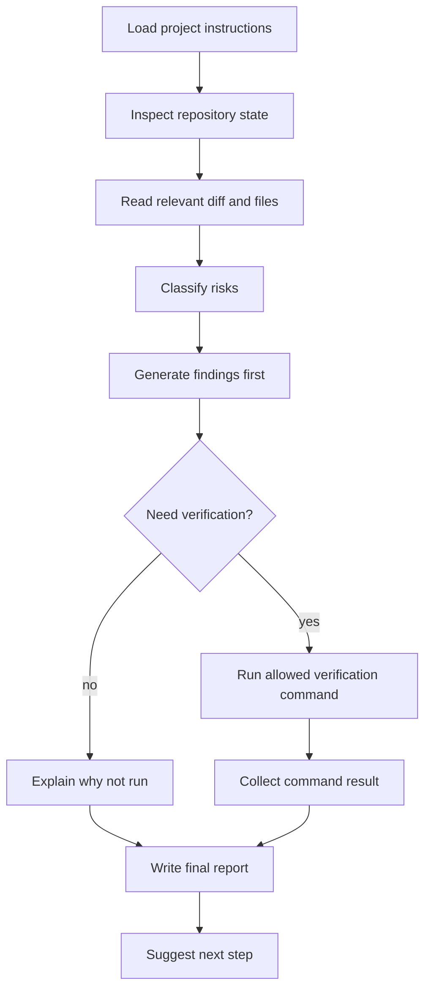

# 第十五章 综合案例：构建 Repo Workflow Agent

前面的章节分别讲了 context、session、tools、extensions、skills、packages、SDK、JSON 和 RPC。本章把它们合成一个真实工作流：Repo Workflow Agent。

这个 agent 不追求“全自动改完代码”。它追求一个更适合团队落地的目标：**在明确安全边界内，帮助开发者审查仓库状态、识别风险、运行验证，并输出可审查报告。**

## 15.1 本章目标与最终产物

完成本章后，你应该能：

- 设计一个只读优先的 repo workflow。
- 把 `AGENTS.md`、skill、extension 和 JSON client 组合起来。
- 定义 review prompt 和输出报告结构。
- 给 agent workflow 设置安全边界和验收标准。
- 把这个案例扩展为第十六章的毕业设计。

最终产物包含：

- 一个 repo review skill。
- 一个 safety extension。
- 一个 JSON/RPC 自动化入口。
- 一个输出报告模板。
- 一组验证命令。

## 15.2 任务边界

Repo Workflow Agent 的默认边界：

| 行为 | 默认策略 |
|---|---|
| 读取文件和 diff | 允许 |
| 运行只读命令 | 允许 |
| 修改文件 | 需要用户明确批准 |
| 删除文件 | 默认阻止 |
| `git commit` | 需要用户明确批准 |
| `git push` / release / deploy | 默认阻止 |
| 上传 session 或代码 | 默认阻止 |

这个边界比“让 agent 自由发挥”更适合团队。它让 agent 先成为可靠 reviewer，再逐步扩展到 executor。

## 15.3 Workflow 总览



关键点：

- 每一步都能被 session 或 event stream 记录。
- 每个危险动作都有明确边界。
- 最终报告必须区分“已验证事实”和“推断建议”。

## 15.4 组件设计

| 组件 | 来源章节 | 责任 |
|---|---|---|
| `AGENTS.md` | 第六章 | 项目规则、语言、验证命令、安全边界 |
| `repo-review` skill | 第十章 | 风险优先 review 流程 |
| `safety-extension.ts` | 第八章 | 阻止危险 shell command |
| JSON event client | 第十三章 | 捕获结构化执行过程 |
| Report template | 本章 | 输出可审查结果 |
| Package skeleton | 第十一章 | 后续团队分发 |

当前仓库已有基础材料：

```bash
code/chapter4-project-context/AGENTS.md
code/chapter6-tool-safety/safety-extension.ts
code/chapter8-skill-package/skills/repo-review/SKILL.md
code/chapter10-programmatic-usage/json-events.mjs
```

## 15.5 推荐项目结构

```text
examples/repo-workflow-agent/
├── README.md
├── .env.example
├── AGENTS.md
├── extensions/
│   └── safety-extension.ts
├── skills/
│   └── repo-review/
│       └── SKILL.md
├── prompts/
│   └── review-current-diff.md
├── scripts/
│   └── run-review.mjs
└── outputs/
    └── sample-review.md
```

在本仓库里，capstone 模板先放在：

```bash
community-projects/example-repo-workflow/README.md
```

## 15.6 Project instruction

`AGENTS.md` 应明确告诉 Pi：

```markdown
# AGENTS.md

## Safety

- Default to read-only analysis.
- Do not modify files unless explicitly approved.
- Do not run destructive git commands.
- Do not push, deploy, publish, or upload data.

## Review Output

- Findings first.
- Include file paths and line references when available.
- Separate verified facts from assumptions.
- Report commands actually run.
```

完整示例见：

```bash
code/chapter4-project-context/AGENTS.md
```

## 15.7 Review skill

Skill 负责 review 方法论，而不是 runtime 拦截。示例：

```bash
code/chapter8-skill-package/skills/repo-review/SKILL.md
```

它要求：

- 先检查 diff。
- 优先 correctness、safety、data loss、security、missing verification。
- findings first。
- 文件和行号优先。
- summary 简短。

这比在 prompt 中临时写一长串规则更稳定。

## 15.8 Safety extension

Extension 负责 runtime 安全边界。示例：

```bash
code/chapter6-tool-safety/safety-extension.ts
```

它拦截：

- `rm -rf`
- `git push --force`
- `curl | sh`
- `chmod -R 777`

这类规则不应该只写在 prompt 中，因为 prompt 不是强制执行层。

## 15.9 Prompt 模板

```text
Review the current repository changes.

Focus on:
- correctness risks
- destructive operations
- missing verification
- public API changes
- documentation/code mismatch

Rules:
- Return findings first.
- Include file references when possible.
- Separate verified facts from assumptions.
- Do not modify files unless I explicitly approve.
- Report every command you actually run.
```

## 15.10 运行方式

### 15.10.1 手动交互方式

先启动 Pi 并加载 extension 与 skill package：

```bash
pi -e ./code/chapter6-tool-safety/safety-extension.ts -e ./code/chapter8-skill-package
```

在 Pi 中输入：

```text
Review the current repository changes without editing files.
Use the repo-review skill if relevant.
```

### 15.10.2 JSON event stream 方式

```bash
node code/chapter10-programmatic-usage/json-events.mjs "Review current repository changes without editing files."
```

适合记录 event counts 和 streaming output。

### 15.10.3 先做只读 shell 检查

```bash
git status --short
git diff --stat
```

这两条命令是 review workflow 的低风险起点。

## 15.11 输出报告模板

```text
# Repo Workflow Report

## Scope

What repository state or diff was reviewed.

## Findings

- [P1] Title
  File: path/to/file:line
  Why it matters:
  Suggested fix:

## Commands Run

- command
  Result:

## Verification Result

What passed, failed, or was not run.

## Assumptions

What was inferred rather than verified.

## Risks and Limitations

Known gaps.

## Suggested Next Step

One concrete next action.
```

## 15.12 验收标准

一个合格的 Repo Workflow Agent 输出应满足：

| 标准 | 要求 |
|---|---|
| 安全 | 不执行未授权写入、提交、push、发布 |
| 可审查 | findings first，包含文件引用 |
| 可验证 | 列出实际运行命令和结果 |
| 可复现 | prompt、输入范围、输出报告可保存 |
| 可扩展 | skill、extension、script 分工清楚 |

如果输出只有“看起来不错”或“建议增加测试”，但没有文件、风险、命令和限制，就不合格。

## 15.13 常见失败模式

| 失败模式 | 修复 |
|---|---|
| Agent 直接开始改文件 | 在 prompt、AGENTS.md 和 safety extension 中默认只读 |
| Review 只有泛泛建议 | 要求 findings first，并要求文件引用 |
| 验证命令没跑 | 最终报告必须列出 command 和结果 |
| 输出不能复现 | 保存 prompt、命令和 sample output |
| Skill 和 extension 职责混乱 | Skill 写流程，extension 做 runtime guard |
| 过早自动化 commit/push | 把 commit/push 留到人工确认阶段 |

## 15.14 延伸：Release Notes Agent

Repo Workflow Agent 可以扩展成 release notes workflow：

```text
Input: git log / PR list / changelog
Process: classify changes -> group by feature/fix/docs -> detect breaking changes
Output: release notes draft + verification checklist
Guard: no tag, no publish, no push without approval
```

这个扩展适合放到 `extra-chapters/` 或第十六章毕业设计中。

## 15.15 本章小结

Repo Workflow Agent 是 Pi 的典型应用：它不是单个 prompt，而是一组 project instructions、skills、extensions、programmatic clients 和验证习惯的组合。课程前面的每个机制都在这里有位置：

- `AGENTS.md` 定义项目规则。
- skill 定义 review 方法。
- extension 定义安全边界。
- JSON/RPC 记录和驱动执行过程。
- session 保存过程。
- package 支持团队分发。

## 习题

1. 为当前仓库生成一份只读 review report。
2. 把 safety extension 和 repo-review skill 打包成 project package。
3. 为 release notes workflow 写一个新的 skill。
4. 给 JSON client 增加输出保存功能，把 event stream 写入 `outputs/events.jsonl`。

## 参考资料

- [JSON Event Stream Mode](https://pi.dev/docs/latest/json)
- [Extensions](https://pi.dev/docs/latest/extensions)
- [Skills](https://pi.dev/docs/latest/skills)
- [Pi Packages](https://pi.dev/docs/latest/packages)
