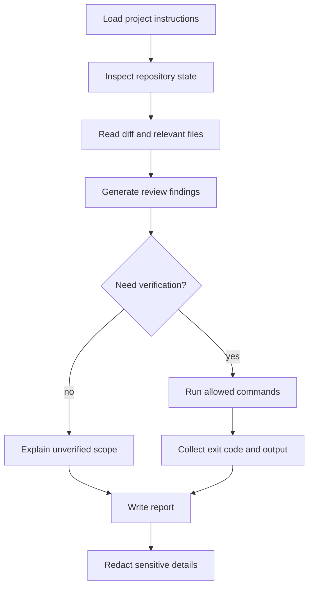

# 第十六章 毕业设计：设计你的团队级 Pi Workflow Agent

毕业设计不是把前面章节的示例简单拼在一起，而是要求你交付一个面向真实团队场景的 Pi Workflow Agent。它应该有清晰边界、可复用知识、受控工具能力、可审计 session、可运行验证命令，以及一份能让别人复现的项目说明。

本章给出 capstone 项目的要求、结构、评分标准和提交流程。你可以沿用第十五章的 Repo Workflow Agent，也可以选择自己的团队场景。

## 16.1 本章目标与最终产物

完成本章后，你应该能：

- 定义一个有明确业务边界的 Pi workflow。
- 组合 `AGENTS.md`、skill、extension、package、JSON/RPC/SDK 入口。
- 输出一次脱敏示例 run，展示 Agent 如何观察、决策、执行和报告。
- 为项目建立本地验证命令和人工验收标准。
- 以社区项目形式提交你的 capstone。

最终产物放在：

```text
community-projects/
└── github-user-workflow-agent/
    ├── README.md
    ├── .env.example
    ├── AGENTS.md
    ├── prompts/
    ├── skills/
    ├── extensions/
    ├── scripts/
    ├── outputs/
    └── docs/
```

如果项目较小，可以省略暂时不用的目录，但 README 必须解释原因。

## 16.2 毕业项目要求

一个合格的毕业项目必须包含六类内容。

| 类别 | 最低要求 | 高质量表现 |
|---|---|---|
| 场景定义 | 说明 workflow 服务谁、解决什么问题 | 给出真实输入、输出和不做什么 |
| Context | 提供 `AGENTS.md` 或等价项目规则 | 规则短、可执行、包含验证命令 |
| Reusable knowledge | 至少一个 skill 或 prompt template | skill 聚焦流程，不塞 runtime 逻辑 |
| Tool boundary | 至少说明工具权限和危险动作 | 用 extension guard 执行强边界 |
| Programmatic entry | JSON、RPC 或 SDK 至少一种 | 有错误处理、timeout、exit code |
| Verification | 提供可运行检查命令 | 区分自动验证与人工验收 |
| Audit output | 一份脱敏示例输出 | 报告事实、推断、限制和命令结果 |

默认安全边界：

- 默认只读。
- 写文件必须有明确批准。
- 删除、强推、发布、部署默认禁止。
- 不上传私有代码、session 或 secret。
- 不声称运行过没有实际运行的命令。

## 16.3 推荐项目结构

推荐结构：

```text
community-projects/github-user-workflow-agent/
├── README.md
├── .env.example
├── AGENTS.md
├── prompts/
│   ├── review-current-diff.md
│   └── write-release-notes.md
├── skills/
│   └── workflow-review/
│       └── SKILL.md
├── extensions/
│   └── safety-extension.ts
├── scripts/
│   ├── run-json-review.mjs
│   └── inspect-output.mjs
├── outputs/
│   ├── sample-input.md
│   └── sample-report.md
└── docs/
    ├── design.md
    └── verification.md
```

各目录职责：

| 目录 | 责任 |
|---|---|
| `prompts/` | 保存一次性或半结构化任务模板 |
| `skills/` | 保存可复用 workflow 知识 |
| `extensions/` | 保存 runtime 能力和强安全边界 |
| `scripts/` | 保存 JSON/RPC/SDK 自动化入口 |
| `outputs/` | 保存脱敏样例输入输出 |
| `docs/` | 保存设计、风险、验证说明 |

## 16.4 选题方向

推荐从真实、窄边界、高频工作流开始。

| 方向 | 适合人群 | 产物 |
|---|---|---|
| Repo Review Agent | 经常做 code review 的团队 | diff findings、风险排序、验证建议 |
| Release Notes Agent | 维护库或应用发布的人 | changelog 草稿、breaking change 检查 |
| CI Failure Triage Agent | 维护复杂 CI 的团队 | 失败分类、日志摘要、修复计划 |
| Documentation Audit Agent | 维护文档站的人 | 断链、过期示例、章节一致性报告 |
| Migration Planning Agent | 做 SDK/API 迁移的人 | 影响面分析、迁移 checklist |
| Security Boundary Agent | 关心供应链和工具风险的人 | package 审查、危险命令拦截 |

选题时避免：

- “自动完成所有开发任务”这类边界过大的目标。
- 需要真实生产权限才能验证的 workflow。
- 只能靠主观评价判断好坏的输出。
- 无法脱敏分享的项目。

## 16.5 必备能力清单

最终项目要覆盖前面章节的核心能力。

| 能力 | 对应章节 | 验收方式 |
|---|---|---|
| Pi 基础使用 | 第三、四章 | README 中有安装和运行说明 |
| Agent Loop 理解 | 第五章 | 输出能解释 tool call 和 observation |
| Context 工程 | 第六章 | `AGENTS.md` 规则清晰可执行 |
| Session 审计 | 第七、十四章 | 提供脱敏策略或 sample session 说明 |
| Tool safety | 第八章 | 危险动作有 guard 或明确拒绝策略 |
| Extension | 第九章 | 至少一个 command、tool 或 hook |
| Skill/template | 第十章 | 至少一个可复用 workflow 文件 |
| Package 思维 | 第十一章 | 说明如何给团队分发或 pin version |
| Programmatic usage | 第十二、十三章 | JSON/RPC/SDK 至少一种入口 |
| 综合案例 | 第十五章 | 有端到端 sample report |

## 16.6 设计文档模板

在项目 `docs/design.md` 中建议包含：

```markdown
# Workflow Agent Design

## Problem

Who uses this workflow and what concrete task does it improve?

## Non-goals

What this workflow will not do.

## Inputs

- Repository state
- User prompt
- Config files
- Optional external data

## Outputs

- Report format
- Files generated
- Events or logs captured

## Safety Boundary

- Allowed actions
- Actions requiring approval
- Blocked actions

## Components

- Project instructions
- Skill or prompt template
- Extension
- Programmatic entry
- Verification commands

## Failure Handling

- Provider error
- Tool failure
- Timeout
- Ambiguous user request
- Missing dependencies

## Verification

Commands that were actually run and what they prove.
```

文档的重点不是篇幅，而是可审查。读者应该能在不读源码的情况下理解这个 Agent 的边界。

## 16.7 README 模板

`README.md` 建议使用以下结构：

````markdown
# Project Name

## What It Does

One paragraph describing the workflow.

## Requirements

- Node.js version
- Pi installation
- Provider/auth requirements

## Quick Start

```bash
node scripts/run-json-review.mjs "Review current diff"
```

## Safety

- Default read-only.
- No destructive git commands.
- No push, deploy, publish, or upload.

## Project Structure

```text
.
├── AGENTS.md
├── skills/
├── extensions/
├── scripts/
└── outputs/
```

## Verification

```bash
node scripts/inspect-output.mjs outputs/sample-report.md
```

## Sample Output

See `outputs/sample-report.md`.
````

## 16.8 验收与评分标准

评分建议：

| 维度 | 分值 | 标准 |
|---|---:|---|
| 问题定义 | 15 | 场景真实、边界清楚、非目标明确 |
| 架构设计 | 20 | instructions、skill、extension、script 分工合理 |
| 安全边界 | 20 | 高风险操作有强约束或明确拒绝策略 |
| 可复现性 | 15 | README 命令能从干净 checkout 跑起 |
| 可观测性 | 15 | 有 event/session/output 审计材料 |
| 内容质量 | 10 | 示例详实，报告区分事实和推断 |
| 贡献质量 | 5 | 目录、命名、链接符合项目规范 |

不通过条件：

- 提交真实 secret。
- 示例输出伪造命令结果。
- 默认允许删除、强推、发布或部署。
- README 缺少运行方式。
- 没有任何验证命令。
- 输出无法判断 Agent 做过什么。

## 16.9 提交流程

1. 在 `community-projects/` 下创建项目目录。
2. 完成 README、`.env.example`、`AGENTS.md`、sample output。
3. 运行本教程文档检查：

```bash
node scripts/verify-docs.mjs
```

4. 运行你自己项目的验证命令。
5. 检查 secret 和私有路径：

```bash
rg -n "sk-|token|secret|password|Authorization|Cookie|BEGIN PRIVATE KEY" community-projects/github-user-workflow-agent
```

6. 在 PR 描述中写明：

```text
Scope:
Verification:
Safety boundary:
Known limitations:
```

不要提交 `.env`、真实 session、未脱敏日志或私有仓库输出。

## 16.10 示例：Repo Workflow Agent 的毕业版

第十五章的案例可以扩展为毕业项目。

基础模板：

```bash
community-projects/example-repo-workflow/README.md
```

毕业版可以增加：

- `skills/repo-review/SKILL.md`：固定 findings-first 的 review 方法。
- `extensions/safety-extension.ts`：阻止危险 shell command。
- `scripts/run-json-review.mjs`：通过 JSON mode 捕获 event stream。
- `outputs/sample-review.md`：一次脱敏 review 报告。
- `docs/design.md`：说明组件边界和安全策略。
- `docs/verification.md`：记录自动检查与人工验收。

推荐 workflow：



示例报告结构：

```text
# Repo Workflow Report

## Scope

Reviewed current git diff and project instructions.

## Findings

- [P1] Title
  File: path/to/file:line
  Evidence:
  Suggested fix:

## Commands Run

- command
  Result:

## Verification

What passed, failed, or was not run.

## Assumptions

What was inferred rather than verified.

## Limitations

Known gaps.
```

## 16.11 常见失败模式

| 失败模式 | 后果 | 修正 |
|---|---|---|
| 选题过大 | 无法验证，只能写概念 | 缩到一个高频 workflow |
| 只有 prompt，没有边界 | 行为不可审计 | 加 `AGENTS.md` 和 safety policy |
| extension 做业务推理 | 难测、难复用 | 业务流程放 skill，extension 只做 runtime 能力 |
| README 命令跑不起来 | 无法复现 | 区分需要 Pi 的命令和本地检查 |
| 输出只有最终结论 | 无法审查 | 增加命令、证据、限制 |
| 使用真实日志 | 泄露风险 | 先脱敏，再提交 |
| 宣称全自动 | 团队难接受 | 先做 reviewer，再开放 executor |

## 16.12 本章小结

毕业设计检验的是你能否把 Pi 的核心机制组织成一个可维护 workflow：清晰上下文、明确工具边界、可复用知识、可恢复 session、可审计输出和可复现验证。一个好的 Pi Workflow Agent 不一定自动做很多事，但它必须让团队知道它看到了什么、做了什么、为什么这么做，以及哪些地方还没有被验证。

## 习题

1. 为你的团队选择一个 workflow 选题，写出目标用户、输入、输出和非目标。
2. 写一份 `AGENTS.md`，要求默认只读、禁止破坏性命令，并明确验证命令。
3. 设计一个 skill 或 prompt template，固定输出结构。
4. 设计一个 safety extension 的拦截矩阵，列出 must block 和 must allow。
5. 准备一份脱敏 sample output，并标注哪些结果来自实际命令。

## 参考资料

- [Pi latest docs](https://pi.dev/docs/latest)
- [Extensions](https://pi.dev/docs/latest/extensions)
- [Skills](https://pi.dev/docs/latest/skills)
- [Pi Packages](https://pi.dev/docs/latest/packages)
- [SDK](https://pi.dev/docs/latest/sdk)
- [JSON Event Stream Mode](https://pi.dev/docs/latest/json)
- [RPC Mode](https://pi.dev/docs/latest/rpc)
