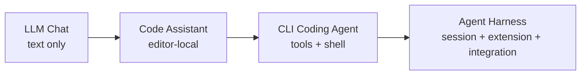
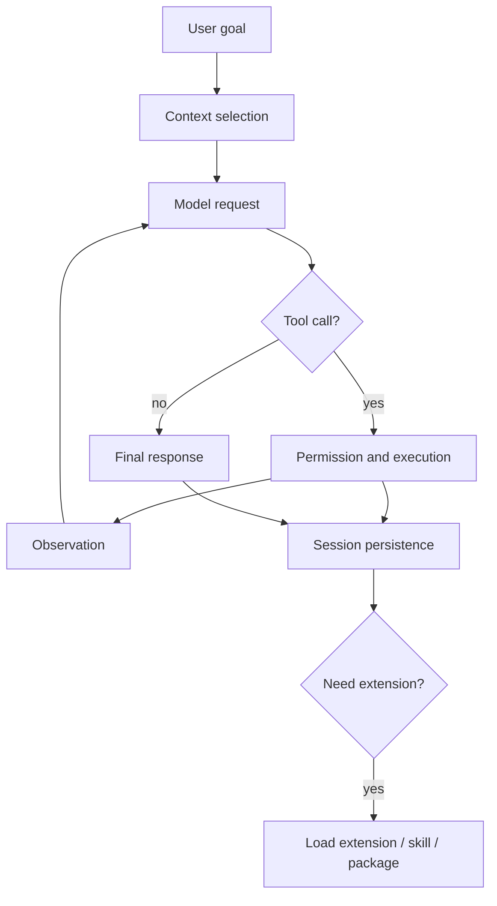

# 第二章 Coding Agent 发展脉络：从 Chat CLI 到可扩展 Agent Harness

为什么需要 Pi 这样的 terminal coding agent harness？如果只是让模型写代码，一个聊天窗口已经够了。本章从工具演进角度说明：真正改变工程 workflow 的不是“模型会回答”，而是“模型能在受控环境中行动、观察、恢复和扩展”。

## 2.1 本章目标与最终产物

完成本章后，你应该能：

- 解释从 LLM Chat 到 Agent Harness 的四阶段演进。
- 说明 terminal 为什么是 coding agent 的关键界面。
- 区分 workflow automation、coding agent 和 agent harness。
- 判断一个开发任务是否值得交给 agent。

本章最终产物是一张“任务适配表”：列出你日常工作中哪些任务适合 Chat、IDE assistant、CLI agent 或 Pi harness。

## 2.2 四阶段演进



| 阶段 | 代表形态 | 核心能力 | 主要限制 |
|---|---|---|---|
| LLM Chat | 网页聊天、API playground | 解释、生成片段、问答 | 人类负责复制、执行、验证 |
| Code Assistant | IDE autocomplete、inline edit | 局部补全和编辑 | 弱任务状态，工具链外部化 |
| CLI Coding Agent | terminal agent、print mode | 读取文件、执行命令、改代码 | 扩展、恢复、审计能力差异大 |
| Agent Harness | Pi 这类 runtime | session、tools、extensions、skills、packages、SDK/RPC | 需要理解边界和治理 |

Pi 站在第四阶段。它的重点不是“再包一层模型 API”，而是把模型行动能力放进一个可恢复、可审计、可扩展的工程外壳。

## 2.3 从问答到行动

早期 LLM 编程使用方式主要是问答：开发者复制代码、粘贴错误、要求模型解释。模型没有直接行动能力，所有上下文选择、命令执行、文件修改都由人完成。

Coding agent 的关键变化是模型开始通过工具改变环境：

```text
User goal -> Read files -> Run command -> Observe output -> Modify plan -> Continue
```

这带来三个新问题：

1. **权限问题**：哪些命令能执行？哪些必须确认？
2. **状态问题**：长任务如何保存、恢复、分支？
3. **上下文问题**：哪些信息该进入模型？历史太长怎么办？

Agent harness 的价值就是把这些问题系统化。

## 2.4 Terminal 为什么重要

Terminal 是工程事实的聚合点：

- `git status` 告诉你工作区状态。
- `npm test`、`pytest`、`xcodebuild` 给出真实验证结果。
- `ls`、`rg`、`cat` 让 agent 感知项目。
- 包管理、构建、发布、CI 日志都天然围绕 shell。

Pi 选择 terminal，不是因为 UI 简陋，而是因为 terminal 是最小、稳定、可脚本化的控制面。之后通过 SDK、JSON、RPC，它仍然可以接入 IDE、CI 或自定义 UI。

## 2.5 Harness 需要解决的问题



成熟 harness 至少要处理：

- 构造 system prompt 和 project context。
- 管理 tool schemas、参数和权限。
- 保存 session，并支持 resume、fork、tree navigation。
- 在上下文过长时 compaction。
- 提供 extension、skill、package 等扩展点。
- 让外部系统通过 SDK/RPC/JSON 观察或驱动 agent。

## 2.6 任务适配表

| 任务 | 推荐工具形态 | 原因 |
|---|---|---|
| 解释一个概念 | LLM Chat | 不需要项目环境 |
| 补全一个函数 | IDE assistant | 上下文局部，延迟敏感 |
| 修一个小 bug 并跑测试 | CLI coding agent | 需要读文件和执行命令 |
| 长期重构一个模块 | Agent harness | 需要 session、计划、验证和恢复 |
| 团队统一 review 流程 | Agent harness + package | 需要分发和治理 |
| CI 中生成结构化报告 | JSON/RPC/SDK | 需要程序化集成 |

## 2.7 Pi 在这条路线中的定位

Pi 可以被理解为：

```text
Pi = terminal UI + coding tools + agent runtime + session manager + extension system + resource loader
```

其中 resource loader 会发现 extensions、skills、prompt templates、themes 和 packages。这个设计让 Pi 不只是一个固定产品，而是一个可以被个人和团队塑形的 agent 工作台。

## 2.8 常见误解

| 误解 | 修正 |
|---|---|
| Coding agent 只是更会写代码的模型 | 关键差异是能感知环境并行动 |
| Terminal agent 不适合团队 | 团队协作依赖规范、settings、packages 和审计 |
| Agent harness 越自动越好 | 可控性、确认机制和可恢复性更重要 |
| 所有能力都应该进核心 | 可扩展 harness 应把团队差异留给 extension 和 package |
| 有 IDE agent 就不需要 CLI agent | CLI 是构建、测试、发布和 CI 的共同语言 |

## 2.9 本章小结

Pi 的价值来自 harness，而不是某个单点功能。理解 coding agent 的演进，能帮助我们判断后续章节中的每个机制为什么存在：session 解决长期任务，tools 解决行动，extensions 解决可编程扩展，skills 解决知识复用，RPC/SDK 解决外部集成。

## 习题

1. 找三个你常用的开发任务，分别判断它们适合 Chat、IDE assistant、CLI agent 还是 Pi harness。
2. 写出一个 terminal agent 必须具备的三条安全规则。
3. 解释为什么“能运行测试”比“能生成代码”更接近 coding agent 的核心。
4. 设计一个团队 workflow，说明它为什么需要 package 而不是只需要 prompt。

## 参考资料

- [Pi latest docs](https://pi.dev/docs/latest)
- [earendil-works/pi](https://github.com/earendil-works/pi)
- [Pi SDK](https://pi.dev/docs/latest/sdk)
- [Pi RPC Mode](https://pi.dev/docs/latest/rpc)
