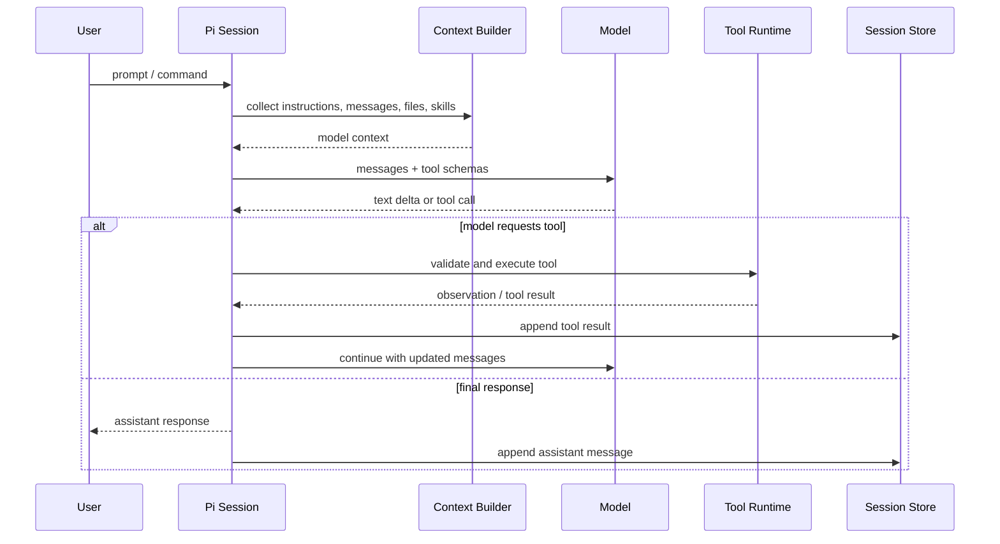
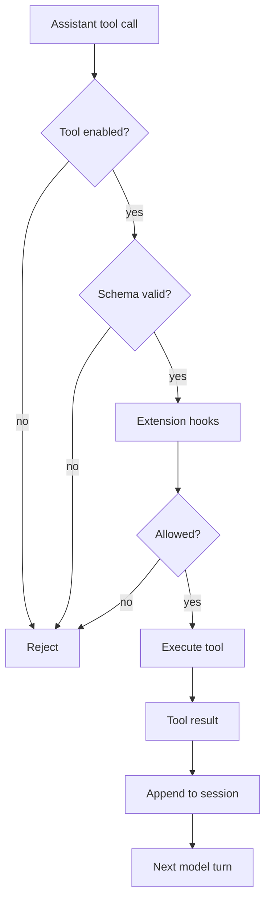

# 第五章 Agent Loop：Message、Tool Call 与 Observation

Pi 能完成工程任务，靠的不是一次模型回答，而是一个可中断、可观察、可持久化的循环：用户给目标，Pi 构建上下文，模型生成文本或工具调用，工具执行后把 observation 写回，模型继续推理，直到任务完成、失败、被压缩或被用户打断。

本章是理解 Pi 的中心章节。后面的 tools、session、extensions、JSON/RPC 都围绕这个 loop 展开。

## 5.1 本章目标与最终产物

完成本章后，你应该能：

- 解释一次 Pi agent run 的完整生命周期。
- 区分 user message、assistant message、tool call、tool result 和 bash execution。
- 理解 streaming、steering、follow-up 的队列语义。
- 用 JSON event stream 观察一次 agent loop。
- 根据 event 判断一次失败发生在 model、tool、context 还是 session 层。

本章最终产物是一份 event timeline 记录，用来描述一次 Pi run 的实际执行过程。

## 5.2 Agent Loop 的基本结构



这个循环不是无限运行。它会在以下情况下停止：

- 模型给出 final response。
- 工具调用失败且无法恢复。
- 用户 abort。
- 达到内部限制。
- 触发 compaction 后重试或停止。
- extension 拦截或改变行为。

## 5.3 Message 类型

Pi session 中保存的是结构化 message，而不是简单文本。

| Message | 产生者 | 含义 |
|---|---|---|
| `user` | 用户或外部接口 | 用户输入、prompt、queued message |
| `assistant` | 模型 | 文本、thinking、tool call |
| `toolResult` | tool runtime | 工具执行结果，反馈给模型 |
| `bashExecution` | Pi shell execution | shell 命令输出记录 |
| `custom` | extension | extension 自定义消息 |
| `branchSummary` | branch summarization | 分支切换摘要 |
| `compactionSummary` | compaction | 历史压缩摘要 |

理解 message 类型的意义在于：当 agent 失误时，你要知道是哪一类信息污染了上下文。

## 5.4 Tool Call 的边界

模型不会直接执行 shell 或改文件。它只能提出 tool call。Pi 再处理：

1. 当前 tool 是否启用。
2. 参数是否满足 schema。
3. 是否触发 extension hook，例如 `tool_call`。
4. 是否需要用户确认。
5. tool runtime 如何执行。
6. result 如何转成 observation。
7. result 是否写入 session。



安全策略应该尽量落在 tool/runtime 层，而不是只写在 prompt 中。

## 5.5 Event timeline

Pi 的 JSON event stream 暴露了 loop 的关键生命周期。

| Event | 含义 | 调试价值 |
|---|---|---|
| `agent_start` | agent run 开始 | 确认任务被接受 |
| `turn_start` | 一轮模型交互开始 | 判断是否进入模型调用 |
| `message_start` | assistant message 开始 | 流式输出开始 |
| `message_update` | 文本或 thinking 增量 | 观察模型正在生成什么 |
| `tool_execution_start` | tool 开始执行 | 识别模型选择了哪个工具 |
| `tool_execution_update` | tool 执行中间状态 | 长任务进度 |
| `tool_execution_end` | tool 执行结束 | 判断 tool 成功或失败 |
| `turn_end` | 一轮结束 | 查看 tool results |
| `agent_end` | agent run 结束 | 判断整体完成 |
| `queue_update` | steering/follow-up 队列变化 | 调试排队消息 |
| `compaction_start` / `compaction_end` | 上下文压缩 | 调试长任务失焦 |

## 5.6 动手实践：观察一次 JSON event stream

运行：

```bash
pi --mode json "List files" 2>/dev/null | jq -c 'select(.type == "message_end" or .type == "tool_execution_end")'
```

如果没有 `jq`，使用本教程脚本：

```bash
node code/chapter10-programmatic-usage/json-events.mjs "List files"
```

预期现象：

- stdout 中会出现 assistant 的文本增量。
- stderr 最后会打印 event counts。
- 如果模型调用工具，会看到 `tool_execution_*` 计数。

注意：这个示例需要本机已安装并认证 Pi。

## 5.7 Steering 与 Follow-up

当 agent 正在 streaming 时，新消息不能简单插入当前上下文。Pi 提供两种队列语义：

| 模式 | 语义 | 适用场景 |
|---|---|---|
| `steer` | 当前 assistant turn 完成工具批次后尽快插入 | 纠偏、补充约束 |
| `followUp` | 当前 agent run 停止后再执行 | 排队后续任务 |

RPC mode 中对应 command：

```json
{"type":"steer","message":"Stop and check tests first."}
```

```json
{"type":"follow_up","message":"After that, summarize the result."}
```

如果 agent 正在 streaming，直接发送普通 prompt 而不指定 queue behavior，RPC 会返回错误。

## 5.8 常见失败模式与定位

| 现象 | 可能层级 | 定位方式 | 修复 |
|---|---|---|---|
| 没有任何输出 | auth/model/provider | 看 stderr 和 provider 配置 | 重新登录或换 model |
| 工具没被调用 | model/tool schema/context | 看 `message_update` 和 tool schemas | 明确要求、改善 tool description |
| 工具调用参数错 | model/schema | 看 `tool_execution_start.args` | 收窄 schema，增加 prompt guidelines |
| 工具输出太长 | tool/context | 看 tool result 内容 | 限制命令输出或截断 |
| agent 越做越偏 | context/session | 看历史 message 和 compaction | 拆任务、命名 session、写 AGENTS.md |
| 危险命令出现 | safety/tool hook | 看 `tool_call` 和 bash command | 用 extension 拦截 |

## 5.9 本章小结

Agent loop 是 Pi 的核心控制流。理解它之后，很多机制会变得清晰：

- Context 决定模型看到什么。
- Tool schemas 决定模型能请求什么。
- Tool results 决定下一轮模型如何理解环境。
- Session 决定历史如何保存和恢复。
- Extension 决定 runtime 如何被扩展和拦截。
- JSON/RPC 决定外部系统如何观察和控制 loop。

## 习题

1. 用 `pi --mode json "List files"` 观察 event 类型，并记录 event 顺序。
2. 找出一次有 tool call 的 session，区分 assistant message 和 tool result。
3. 写一个 prompt，要求 Pi 先计划再执行，比较 tool call 数量是否减少。
4. 设计一个 safety hook：当 bash command 包含 `rm -rf` 时阻止执行。

## 参考资料

- [JSON Event Stream Mode](https://pi.dev/docs/latest/json)
- [RPC Mode](https://pi.dev/docs/latest/rpc)
- [Session Format](https://pi.dev/docs/latest/session-format)
- [Extensions](https://pi.dev/docs/latest/extensions)
