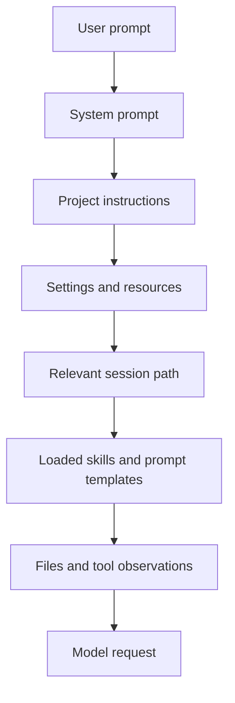

# 第六章 Context 工程：AGENTS.md、文件上下文与 Compaction

Agent 的质量很大程度取决于上下文质量。Pi 可以读取文件、使用项目指令、加载 skills 和 prompt templates，也会在长任务中触发 compaction。本章关注如何让上下文稳定、低噪音、可维护。

## 6.1 本章目标与最终产物

完成本章后，你应该能：

- 设计项目级 `AGENTS.md`。
- 区分 system prompt、project instruction、session message、skill 和 file context。
- 理解 compaction 为什么会改变 agent 看到的历史。
- 写出 context hygiene checklist。
- 运行本章示例，让 Pi 解释项目规则。

本章最终产物是一份项目级 `AGENTS.md` 和一张 context 来源表。

## 6.2 Context 来源

| 来源 | 典型内容 | 生命周期 | 风险 |
|---|---|---|---|
| System prompt | Pi 基础行为规则和工具说明 | Pi runtime 管理 | 用户不可完全控制 |
| Project instructions | `AGENTS.md`、项目规范 | 仓库级 | 太长会稀释重点 |
| Settings | provider、model、tools、resources、compaction | 全局或项目级 | secret 不应放这里 |
| Session messages | 用户、assistant、tool result | session 级 | 长历史会失焦 |
| Skills | 专项工作流说明 | 按需加载 | 描述不准会触发错误 |
| Files | 被 read/edit/write 涉及的文件 | 任务级 | 读太多会增加噪音 |
| Tool results | shell 输出、文件内容、API 返回 | turn 级 | 输出过长会污染上下文 |

Context 工程的目标不是“把所有东西塞给模型”，而是让模型在当前任务中看到最少但足够的信息。

## 6.3 Context 构建流程



上下文不是静态的。每次 tool result、follow-up、compaction、branch navigation 都可能改变下一轮模型看到的内容。

## 6.4 AGENTS.md 的写法

好的 `AGENTS.md` 应该短而硬：

- 明确语言和命名规则。
- 明确测试命令。
- 明确不能做的高风险操作。
- 明确项目结构和责任边界。
- 明确最终输出要求。
- 不写泛泛的价值观。

本教程示例：

```bash
code/chapter4-project-context/AGENTS.md
```

核心片段：

```markdown
## Verification

Before claiming work is complete, run the most relevant verification command and report the exact command.

For documentation-only changes, run:

```bash
node scripts/verify-docs.mjs
```
```

这类规则比“认真检查”更可执行。

## 6.5 Settings 与 context

Pi 使用 JSON settings 文件：

| Location | Scope |
|---|---|
| `~/.pi/agent/settings.json` | global |
| `.pi/settings.json` | project |

典型 project settings：

```json
{
  "defaultProvider": "anthropic",
  "defaultThinkingLevel": "medium",
  "compaction": {
    "enabled": true,
    "reserveTokens": 16384,
    "keepRecentTokens": 20000
  },
  "sessionDir": ".pi/sessions",
  "enableSkillCommands": true
}
```

Settings 决定运行环境，`AGENTS.md` 决定项目行为。不要混用：测试命令适合写 `AGENTS.md`，provider 默认值适合写 settings。

## 6.6 Compaction 的影响

当上下文接近模型窗口上限时，Pi 会把较早消息总结成 `CompactionEntry`。这能继续任务，但会损失细节。

Compaction 前：

```text
system + full early messages + recent messages
```

Compaction 后：

```text
system + compaction summary + recent messages
```

因此：

- 关键决策应写入文件，而不是只留在聊天历史。
- 长任务要分阶段命名 session。
- 复杂分支要用 label 标记重要节点。
- compaction 后如果行为变差，重新给出当前目标和约束。

## 6.7 动手实践：让 Pi 读取项目规则

进入示例目录：

```bash
cd code/chapter4-project-context
```

启动 Pi：

```bash
pi
```

输入：

```text
Read AGENTS.md and summarize the constraints you must follow before editing files.
```

预期回答应包含：

- 用户交流用中文。
- 代码、注释、命令、提交信息用 English。
- 不提交 secret。
- 不运行 destructive git commands。
- 完成前要运行相关验证命令。

## 6.8 Context hygiene checklist

| 检查项 | 原因 |
|---|---|
| `AGENTS.md` 小于 200 行 | 太长会稀释重点 |
| 测试命令明确 | agent 不需要猜验证方式 |
| 高风险操作显式禁止 | 减少不可逆动作 |
| 输出格式明确 | 减少后续修正成本 |
| 关键状态落文件 | 抵抗 compaction 信息损失 |
| 大文件按需读取 | 降低上下文噪音 |
| session 定期命名 | 便于恢复和审计 |

## 6.9 常见问题

| 问题 | 根因 | 修复 |
|---|---|---|
| Agent 忽略项目规则 | 规则太长或不具体 | 缩短并改成可执行命令 |
| 长任务后偏离目标 | compaction 损失细节 | 写阶段总结到文件 |
| 输出格式不稳定 | 没有明确格式约束 | 在 prompt 或 AGENTS.md 写清 |
| 验证命令没跑 | 没有强规则或命令不明确 | 写入 `Verification` 小节 |
| skill 误触发 | description 太宽泛 | 收窄 skill description |

## 6.10 本章小结

上下文不是越多越好，而是越可执行越好。Pi 的 project instructions、settings、skills、session messages、file reads 和 compaction 共同构成 context strategy。高质量项目会把关键规则写入文件，把临时目标写入 prompt，把专项流程写入 skill。

## 习题

1. 给一个真实项目写 30 行以内的 `AGENTS.md`。
2. 把“不要重写历史”改写成具体禁止命令。
3. 开一个长 session，手动执行 `/compact`，观察摘要如何影响后续回复。
4. 给你的项目设计一张 context 来源表。

## 参考资料

- [Settings](https://pi.dev/docs/latest/settings)
- [Compaction](https://pi.dev/docs/latest/compaction)
- [Skills](https://pi.dev/docs/latest/skills)
- [Session Format](https://pi.dev/docs/latest/session-format)
