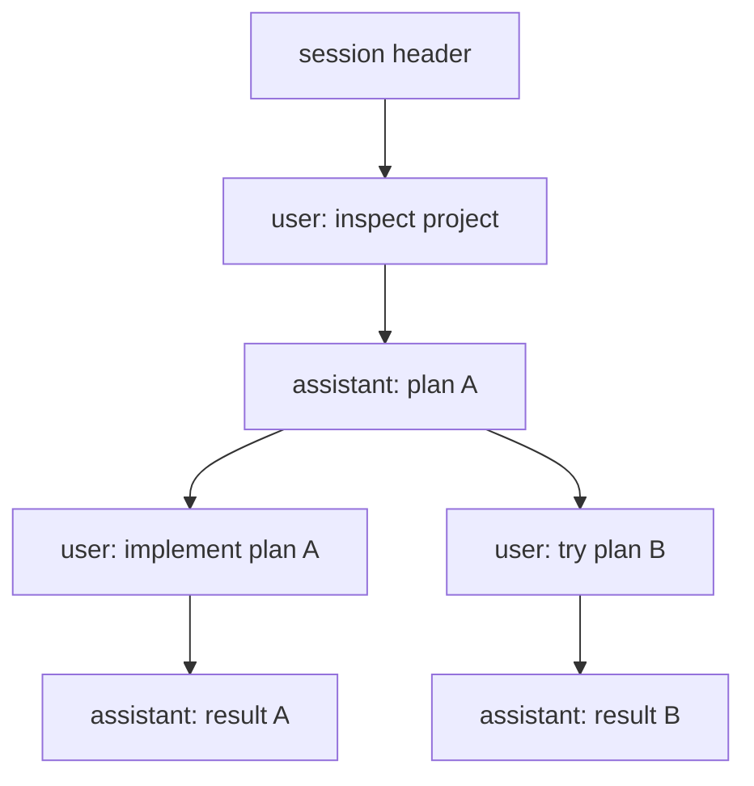

# 第七章 Session Tree：JSONL、Branch、Fork 与 Label

Pi session 不是线性 transcript。它保存为 JSONL，并通过 `id` / `parentId` 形成树。这允许你从过去的任意点继续、fork、clone、label 和 compact。

## 7.1 本章目标与最终产物

完成本章后，你应该能：

- 找到 session 文件位置。
- 理解 session header、message entry、compaction entry、label entry。
- 区分 resume、fork、clone 和 tree navigation。
- 用脚本解析 JSONL session。
- 解释 active leaf 如何决定当前上下文路径。

本章最终产物是运行 session inspector，读懂一个 sample session tree。

## 7.2 Session 存储

默认位置：

```text
~/.pi/agent/sessions/--<path>--/<timestamp>_<uuid>.jsonl
```

其中 `<path>` 是工作目录路径经过转换后的目录名。你也可以通过 settings 或 CLI 指定 session directory。

常用命令：

```bash
pi -c
pi -r
pi --session <path-or-id>
pi --fork <path-or-id>
pi --no-session
```

交互命令：

```text
/resume
/new
/name <name>
/session
/tree
/fork
/clone
/compact [prompt]
```

## 7.3 JSONL entry

第一行是 session header：

```json
{"type":"session","version":3,"id":"uuid","timestamp":"2026-06-01T00:00:00.000Z","cwd":"/path/to/project"}
```

后续 entry 通过 `id` 和 `parentId` 建树：

```json
{"type":"message","id":"a1b2c3d4","parentId":null,"timestamp":"2026-06-01T00:00:01.000Z","message":{"role":"user","content":"Hello"}}
```

常见 entry：

| Entry | 作用 |
|---|---|
| `session` | header，记录 version、id、cwd |
| `message` | user、assistant、toolResult 等 message |
| `model_change` | 中途切换 model |
| `thinking_level_change` | 中途切换 thinking level |
| `compaction` | 上下文压缩摘要 |
| `branch_summary` | 分支切换摘要 |
| `label` | 给 entry 添加 label |
| `session_info` | session metadata |

## 7.4 Tree mental model



同一个 session 文件可以保存多个分支。active leaf 决定当前上下文路径。`/tree` 可以移动 active leaf，`/fork` 可以从已有历史创建新 session。

## 7.5 Resume、Fork、Clone、Tree 的区别

| 操作 | 作用 | 是否新 session | 适合 |
|---|---|---|---|
| `resume` / `pi -c` | 继续最近或选定 session | 否 | 回到之前工作 |
| `/tree` | 在当前 session 树中切换位置 | 否 | 探索不同分支 |
| `/fork` / `pi --fork` | 从历史创建新 session | 是 | 隔离新方向 |
| `/clone` | 复制当前 active branch | 是 | 保留当前路径再实验 |
| `/new` | 全新 session | 是 | 新任务 |

## 7.6 本章示例

运行：

```bash
node code/chapter5-session-inspector/inspect-session.mjs code/chapter5-session-inspector/sample-session.jsonl
```

预期输出：

```text
Session: sample-session
Version: 3
CWD: /tmp/how-to-pi
Entries: 7
Branches: 2
Roles:
  assistant: 3
  toolResult: 1
  user: 2
Labels:
  checkpoint: a5e6f7a8
```

这个输出说明 sample session 中存在分支，并且 `a5e6f7a8` 被标记为 `checkpoint`。

## 7.7 Inspector 做了什么

脚本文件：

```bash
code/chapter5-session-inspector/inspect-session.mjs
```

它会：

1. 逐行读取 JSONL。
2. 解析 session header。
3. 统计 message role。
4. 根据 `parentId` 统计 branch 数。
5. 输出 label。

这是理解 session format 的最低成本方法。

## 7.8 常见陷阱

| 陷阱 | 影响 | 避免方式 |
|---|---|---|
| 手动编辑真实 session | 可能破坏树结构 | 只复制样本后实验 |
| 以为 `/fork` 等于复制文本 | fork 会保留历史上下文边界 | 用 `/session` 确认文件 |
| 长分支不命名 | resume 时难找 | 关键任务立即 `/name` |
| compaction 后丢细节 | 摘要不能保留所有原文 | 关键决定写入 repo 文件 |
| 公开 session 前不脱敏 | 泄露路径、代码、secret | 分享前清理 |

## 7.9 本章小结

Session tree 是 Pi 能支持长期任务和分支探索的基础。读懂 JSONL 后，你可以更可靠地调试、分享、审计和分析 agent 工作流。后续 JSON/RPC 集成也会复用这些 session 和 event 概念。

## 习题

1. 用 `/tree` 从早期用户消息创建一个新分支。
2. 给关键 entry 添加 label。
3. 复制一个真实 session 到临时目录，用 inspector 查看 role 分布。
4. 修改 inspector，输出每个 entry 的 `id -> parentId`。

## 参考资料

- [Sessions](https://pi.dev/docs/latest/sessions)
- [Session Format](https://pi.dev/docs/latest/session-format)
- [Compaction](https://pi.dev/docs/latest/compaction)
