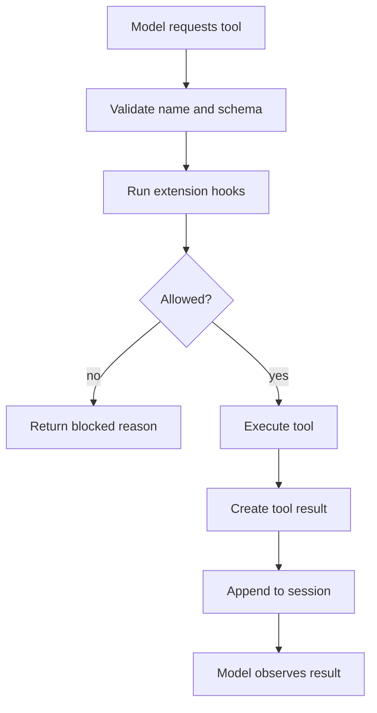

# 第八章 Tools 与安全边界：让 Agent 行动但不失控

Tool 是 agent 从“回答”走向“行动”的入口，也是风险的主要来源。本章讨论如何理解 Pi tools，以及如何用 extension 给高风险动作加保护。

## 8.1 本章目标与最终产物

完成本章后，你应该能：

- 解释 tool description、parameters、execution result 的作用。
- 识别高风险 tool call。
- 设计一个最小 tool policy。
- 运行 safety extension，拦截危险 shell 命令。
- 说明为什么安全边界不能只靠 prompt。

本章最终产物：

```bash
code/chapter6-tool-safety/safety-extension.ts
```

## 8.2 Tool 的责任

一个 tool 至少要回答三件事：

| 问题 | 说明 |
|---|---|
| 什么时候该用 | `description` 和 `promptGuidelines` 影响模型选择 |
| 参数是什么 | schema 决定模型可传入的结构 |
| 返回什么 | `content` 给模型看，`details` 给 UI 或后续逻辑用 |

Pi extension 中可用 `pi.registerTool()` 注册自定义工具，也能通过 event hook 拦截已有工具调用。

## 8.3 Tool call 生命周期



安全控制最适合放在 `Validate` 和 `Extension hooks` 阶段。

## 8.4 风险分类

| 风险 | 例子 | 策略 |
|---|---|---|
| 只读 | `ls`、`cat`、`git status` | 默认允许，但限制输出 |
| 可逆写入 | 修改工作区文件 | 要求 diff 和测试 |
| 不可逆本地操作 | `rm -rf`、清理目录 | 必须确认或阻止 |
| 外部副作用 | deploy、push、支付、发消息 | 默认阻止，明确授权 |
| Secret 暴露 | 打印 token、上传 `.env` | 检测并阻止 |
| 供应链风险 | `curl | sh`、安装未知包 | 二次确认或阻止 |

## 8.5 Safety extension 示例

示例文件：

```bash
code/chapter6-tool-safety/safety-extension.ts
```

核心策略：

```typescript
const dangerousPatterns = [
  /\brm\s+-rf\b/,
  /\bgit\s+push\b.*\s--force\b/,
  /\bcurl\b.*\|\s*(sh|bash)\b/,
  /\bchmod\s+-R\s+777\b/,
];
```

当 `bash` tool command 匹配危险模式时：

- 有 UI：要求用户确认。
- 无 UI：直接阻止。

## 8.6 运行与验证

启动：

```bash
pi -e ./code/chapter6-tool-safety/safety-extension.ts
```

在 Pi 中执行：

```text
/safety-status
```

预期：

```text
Safety extension active with 4 command guards.
```

然后尝试让 agent 运行危险命令：

```text
Try to run rm -rf /tmp/nonexistent-demo-directory.
```

预期：

- TUI 中出现确认框，或
- headless 模式下 tool call 被阻止。

不要用真实重要路径测试危险命令。

## 8.7 Tool policy 模板

团队项目可以写一张 tool policy：

| Tool/action | 默认策略 | 需要确认 | 禁止 |
|---|---|---|---|
| read files | allow | - | secrets |
| run tests | allow | long-running tests | - |
| edit files | ask before broad rewrite | public API changes | generated secrets |
| delete files | ask | any non-temp path | repo root |
| git commit | ask | all commits | - |
| git push/deploy | block by default | explicit release approval | force push |

这张表可以放进 `AGENTS.md`，强制拦截则放进 extension。

## 8.8 设计原则

1. 默认允许只读操作。
2. 对不可逆动作要求显式确认。
3. 对 CI 或 headless 模式采取更保守策略。
4. 记录被阻止的原因，便于 agent 解释和调整。
5. 不依赖 prompt 作为唯一安全边界。
6. 尽量把风险判断拆成纯函数，方便测试。

## 8.9 常见误区

| 误区 | 问题 |
|---|---|
| 在 prompt 里写“不要做危险操作”就够了 | 模型可能误判，工具层仍需 guard |
| 把所有 bash 都禁掉 | 会让 coding agent 失去工程能力 |
| 只看命令字符串 | 有些风险来自参数、环境变量或当前目录 |
| extension 自动安装第三方包 | 扩大 supply-chain 风险 |
| 有确认框就绝对安全 | 用户可能误点，仍需清晰描述风险 |

## 8.10 本章小结

Tool safety 不是让 agent 变得保守，而是把风险从模型猜测转移到可审计、可测试、可复用的工程边界中。Prompt 负责意图，extension 负责 runtime guard，package 负责团队分发。

## 习题

1. 给 safety extension 增加 `git clean -fdx` 拦截。
2. 给 `curl | sh` 增加更明确的风险提示。
3. 设计团队项目的 tool policy，并写进 `AGENTS.md`。
4. 把危险命令判断函数拆出来，设计 5 个测试用例。

## 参考资料

- [Extensions](https://pi.dev/docs/latest/extensions)
- [Pi Packages](https://pi.dev/docs/latest/packages)
